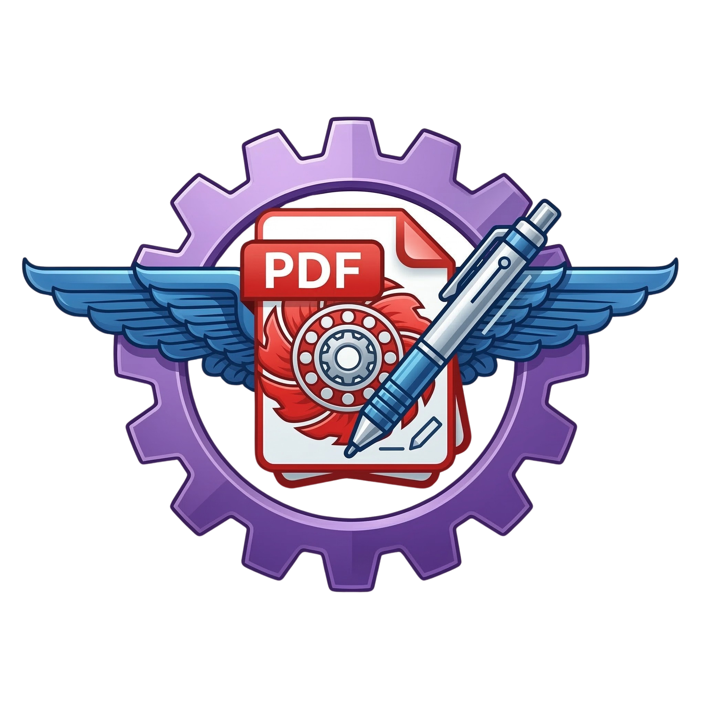
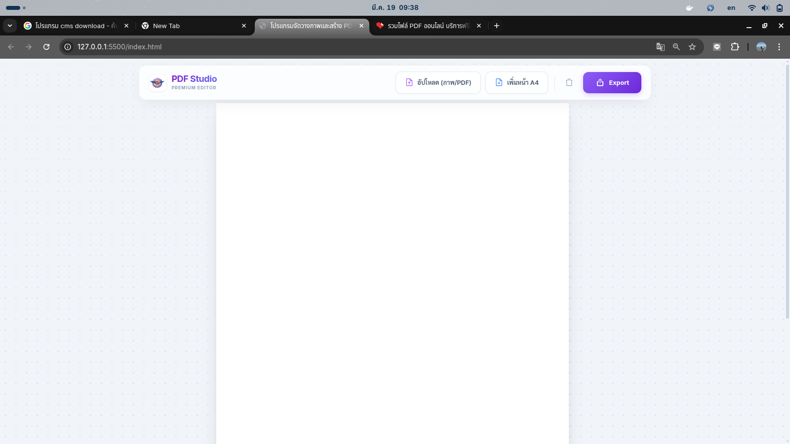

  
  <h1>🎨 PDF Studio</h1>
  
<strong>โปรแกรมสร้างและจัดวางภาพ/PDF แบบอิสระ (Premium Creative Editor)</strong>

**PDF Studio** เป็นเว็บแอปพลิเคชันรูปแบบ Glassmorphism สไตล์พรีเมียม สำหรับจัดวางภาพและไฟล์ PDF บนหน้ากระดาษ A4 ได้อย่างอิสระ พร้อมความสามารถในการปรับแต่งและส่งออกเป็นไฟล์ได้หลายรูปแบบ (PDF, PNG, JPEG) เหมาะสำหรับการสร้างเอกสารที่เน้นการจัดวางรูปภาพอย่างรวดเร็วและสวยงาม

## ✨ คุณสมบัติเด่น (Features)

- **รองรับทั้งภาพและ PDF:** อัปโหลดและป้อนไฟล์ภาพ (JPG, PNG) หรือไฟล์ PDF เพื่อนำใบหน้าแยกจัดวางใหม่
- **รักษาสัดส่วนสมจริง (Smart Aspect Ratio):** ไฟล์ภาพและหน้า PDF ที่นำเข้ามาจะคงอัตราส่วนเดิม ไม่ถูกบีบให้เสียรูป
- **จัดวางภาพอิสระ (Freeform Layout):** ลากและวางรูปภาพได้ทุกตำแหน่งบนหน้ากระดาษ นำทางและสลับหน้าได้อย่างอิสระ
- **ปรับแต่งได้สมบูรณ์ (Manipulation Tools):**
  - **ย่อ/ขยาย (Resize):** ปรับขนาดภาพตามความต้องการจากมุมทั้ง 4
  - **หมุน (Rotate):** หมุนภาพได้อย่างอิสระ 360 องศา พร้อม**ป้ายบอกองศา (Angle Badge)**
  - **ลบ (Delete):** ลบภาพที่ไม่ต้องการออกได้ในทันทีด้วยปุ่มลบ หรือกดคีย์ตัว Delete บนแป้นพิมพ์
- **ระบบช่วยจัดวาง (Smart Guides):** ระบบดูดภาพเข้าหาจุดกึ่งกลาง (Snapping) ทั้งแนวตั้งและแนวนอนช่วยให้ผลงานสวยงามและเป๊ะ
- **รองรับหลายหน้า (Multi-page Support):** เพิ่มหน้ากระดาษ A4 เข้ามาในโปรเจ็กต์ได้ไม่จำกัด
- **ส่งออกหลายรูปแบบ (Multi-format Export):** 
  - 📄 **PDF Document** (รวมทุกหน้าเป็นไฟล์เดียว)
  - 🖼️ **PNG Image** (ความละเอียดสูง ได้ไฟล์แยกแต่ละหน้า)
  - 🖼️ **JPEG Image** (ขนาดไฟล์เล็ก ได้ไฟล์แยกแต่ละหน้า)

## 🛠 เทคโนโลยีที่ใช้ (Technologies)

- **Frontend:** HTML5, Vanilla JavaScript
- **Styling:** CSS3, [Tailwind CSS](https://tailwindcss.com/)
- **Icons:** [Phosphor Icons](https://phosphoricons.com/)
- **Library หลัก:**
  - `pdf.js` สำหรับอ่าน ทอนหน้า และดึงข้อมูลไฟล์ PDF ขึ้นมา
  - `html2canvas` สำหรับการแคปเจอร์ภาพและแปลงส่วนประกอบ DOM
  - `jsPDF` สำหรับการประกอบเข้าและดาวน์โหลดเป็นไฟล์ PDF คุณภาพสูง

## 🚀 วิธีใช้งาน (How to Use)

1. **อัปโหลดเบื้องต้น:** กดปุ่ม "อัปโหลด (ภาพ/PDF)" เพื่อป้อนรูปภาพหรือเอกสารเข้าสู่ระบบ
2. **จัดวางและปรับแต่ง:**
   - **สไตล์ Glassmorphism:** ควบคุมหน้าตาของ Workspace ได้อย่างอิสระ
   - **คลิก** ที่รูปภาพเพื่อเข้าสู่โหมดปรับแต่ง (Outline สีม่วงจะแสดงขึ้นมา)
   - **ลาก** เพื่อย้ายตำแหน่ง (ลากข้ามหน้ากระดาษแผ่นอื่นได้อย่างลื่นไหล)
   - **ดึงจุดหมุน (Handle)** ด้านบนเพื่อหมุนภาพ
3. **จัดการหน้า:** เพิ่มและลบหน้า A4 ได้ทุกเมื่อตามต้องการ
4. **ดาวน์โหลด:** เมื่อประกอบผลงานเสร็จสิ้น กดคำว่า "Export" ตรงแถบเครื่องมือ และเลือกสกุลไฟล์เพื่อดาวน์โหลด

---
*โปรเจกต์นี้ถูกออกแบบมาเพื่อประสบการณ์การทำงานที่ลื่นไหล พร้อม UI สไตล์พรีเมียมและความง่ายในการใช้งาน (Premium UX/UI Design Aesthetics)*
